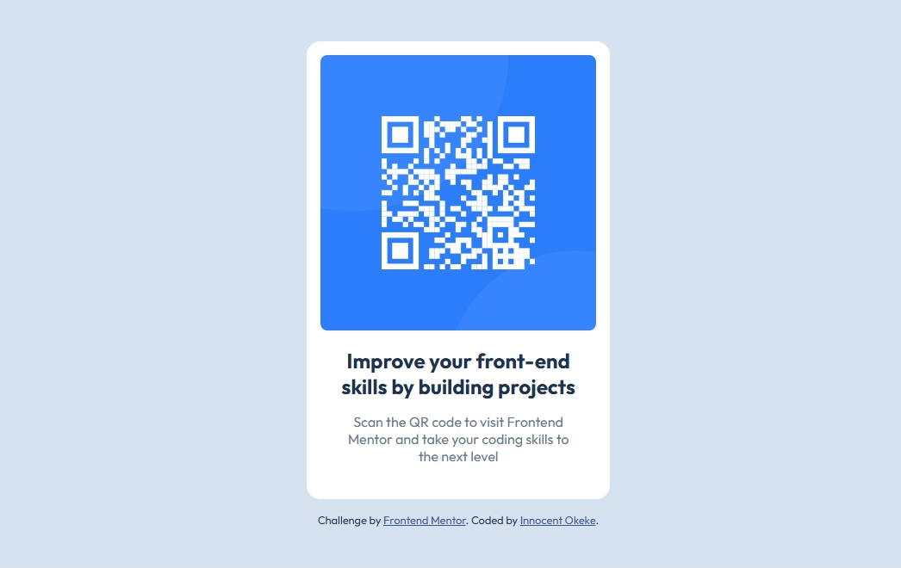

# Frontend Mentor - QR code component solution

This is a solution to the [QR code component challenge on Frontend Mentor](https://www.frontendmentor.io/challenges/qr-code-component-iux_sIO_H).

## Table of contents

- [Screenshot](#screenshot)
- [Links](#links)
- [Built with](#built-with)
- [Author](#author)

### Screenshot

### Links

- Solution URL: [github.com/Innocent-Leo/QR-code-component.git](https://github.com/Innocent-Leo/QR-code-component.git)
- Live Site URL: [css-qr-code-component.netlify.app](https://css-qr-code-component.netlify.app/)

### Built with

- Semantic HTML5 markup
- CSS custom properties
- Flexbox

## Author

- LinkedIn - [@Innocent Okeke](https://www.linkedin.com/in/innocent-okeke-55990b20a)
- Frontend Mentor - [@Innocent-Leo](https://www.frontendmentor.io/profile/Innocent-Leo)
