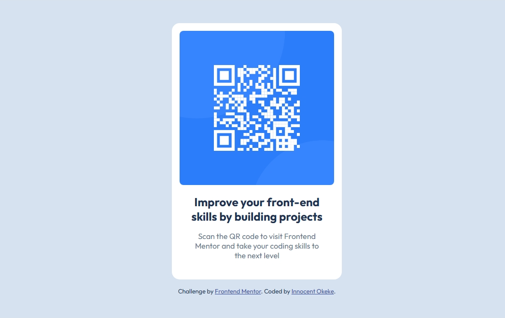

# QR Code Card UI

A responsive QR code card component built with semantic HTML and modern CSS.

This project focuses on clean layout structure, spacing consistency, and responsive centering techniques using Flexbox.

---

## Overview

The goal of this project was to recreate a minimal UI component while maintaining:

- Semantic HTML structure
- Consistent spacing and typography
- Responsive layout behavior across screen sizes
- Clean and readable CSS organization

Although simple in functionality, this project emphasizes attention to visual detail and layout precision.

---

## Built with

- HTML5
- CSS3
- Flexbox

---

## What I Practiced

- Structuring semantic markup
- Centering techniques with Flexbox
- Managing spacing and visual hierarchy
- Writing clean, maintainable CSS

---

## Screenshot

---

## Live Demo

[View Live Site](https://css-qr-code-component.netlify.app/)

---

## Future Improvements

- Improve accessibility attributes
- Explore component scaling within a larger layout system
